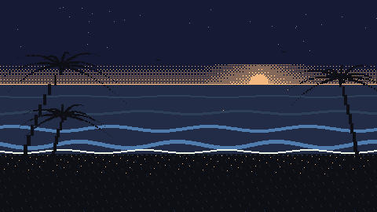

# Dawn Patrol 🌊



**[Surf it here](https://caromada.github.io/Dawn-Patrol/)**

A retro pixel-art surf game where the ocean is real. Pick a real California break and the waves you paddle into are synthesized from the live directional wave spectrum of the nearest NOAA buoy, reconstructed through wave superposition with real oceanography: the full dispersion relation, energy-flux shoaling, and breaking at 0.78 times the water depth. Flat Tuesday at Lowers means a flat, frustrating game. Overhead Friday means the game is pumping. After every ride a judge scores you 0 to 10 on WSL criteria and the broadcast booth prints a one-line call. Built with plain HTML, CSS and JavaScript: no frameworks, no build step, no image or audio files, and it costs nothing to host.

## How to play

1. Pick a break. The cards show the actual conditions at each buoy right now.
2. **PADDLE OUT**, use **&larr; &rarr;** to move around the lineup, and wait for a set.
3. When the marker flashes **PADDLE!**, hit **SPACE** to take off. Late is better.
4. Alternate **&uarr; &darr;** to pump for speed. **X** snaps off the lip, **C** wraps a cutback from the shoulder, **F** floats over a breaking section, and **SPACE** kicks out clean.
5. Stall in the pocket of a pitching wave for barrel time. Get swallowed by the foam ball and the judges will remember it.
6. **M** toggles sound, **ESC** returns to the lineup select. Session best is saved per break.

## The ocean is not decoration

- The telemetry strip along the top is live instrument data: buoy ID, significant wave height, peak period and direction, observation time, and data age.
- Every 30 minutes a GitHub Action fetches each station's raw NDBC spectral files (`.data_spec`, `.swdir`, `.swr1`, plus the met file), stores them as fetched, parses the newest observation, and commits a compact JSON. GitHub Pages redeploys on the commit, which is the same cadence the buoys report at.
- The synthesis takes the ~64 frequency bins of energy density S(f), keeps the components actually aimed at the beach (directional projection against the shore normal, softened by the r1 spread parameter), converts each bin to a sinusoid with amplitude sqrt(2 S df), and marches them over a beach profile. Wave number comes from Newton iterations on the full dispersion relation, shoaling gain from group-velocity flux conservation, and any crest taller than 0.78 times the local depth breaks into a whitewater bore that the game logic and renderer both consume.
- A 16 second groundswell rolls through as long-period corduroy with real lulls between sets. Short-period windswell shows up as chop. Combo swells produce the peaky crossed-up lineup that combo swells actually produce, because the interference is computed, not designed.

## The judge

Every ride logs a trace: takeoff height against the day's significant height, late-drop timing, maneuvers with quality grades, sections made, barrel time, speed profile, and how the ride ended. A deterministic judge scores it on WSL-style criteria (commitment and difficulty, combination, variety, speed-power-flow) with diminishing returns for repeating the same move, and a template bank in broadcast voice prints the call.

**AI booth mode**: paste your own Anthropic API key on the menu and Claude writes the commentary live instead, plus a coaching tip for your next wave, anchored to the deterministic score. One structured-output call per ride, validated against a JSON schema, retried once, cached by ride-trace hash so nothing is paid for twice. The key lives only in your browser's localStorage and is sent only to api.anthropic.com.

## Everything is drawn and synthesized in code

- The surfer is a set of two-frame character-grid sprites defined right in `js/sprites.js`, always rendered silhouette black so it reads as any surfer.
- The score digits, telemetry strip, and every in-game label use a hand-drawn 5x7 bitmap font in `js/hud.js`. No font files, no web fonts.
- The dawn sky is 4x4 Bayer ordered dithering in the pre-dawn palette: indigo, wave-face blue, foam, first-light peach, silhouette black. The menu beach with its swaying palms is the same palette drawn procedurally every frame.
- All audio is Web Audio synthesis: the ocean is filtered looping noise that swells when waves break near you, and every cue from the pop-up blip to the score fanfare is an oscillator envelope.
- Score digits roll like a mechanical counter, commentary types out at 30 characters per second, and `prefers-reduced-motion` kills the particles and the digit roll while keeping the wave, because the wave is content.

## Architecture

```
index.html               shell, break picker, canvas
css/style.css            theme tokens, HUD chrome, reduced-motion rules
js/theme.js              the palette and motion constants, one source of truth
js/wave.js               spectral synthesis (pure, unit tested)
js/game.js               fixed-timestep loop, surfer state machine, renderer
js/judge.js              deterministic WSL scorer + commentary bank (pure, tested)
js/llm.js                the one structured LLM call, model names, caching
js/menu-scene.js         procedural beach with palms for the landing screen
js/sprites.js, hud.js    character-grid sprites, 5x7 bitmap font
js/audio.js, data.js     Web Audio chiptune, buoy JSON loader with demo fallback
data/buoys.json          latest parsed spectra, committed by the cron workflow
data/raw/                the NDBC files exactly as fetched, for reprocessing
scripts/fetch-buoys.mjs  parser, no dependencies, timeout and retry on every fetch
scripts/test-*.mjs       synthesis and judging invariants, run in CI on every refresh
.github/workflows/       the 30 minute buoy cron
```

## What was hard

- **The phase sign.** A surface built as sin(kx + wt) propagates toward deep water, and for a while the game's waves rolled politely away from the beach while the crest tracker chased them backward. One minus sign turned it into an ocean.
- **Crest tracking through interference.** With 20+ components superposed, local maxima appear, merge, and vanish frame to frame. Tracking "the wave you caught" by nearest-crest kept re-locking onto the next set wave outside, so rides never ended. The fix was a forward-biased search window plus a grace period where you coast on the bore if your crest momentarily dissolves into the pattern.
- **Making a spectrum feel like a surf spot.** Hs from the reconstruction had to match the buoy's own reported WVHT (it does, within a few percent, checked in CI against the live spectrum), but game feel needed exaggerated vertical scale, a hand-tuned pump-versus-trim speed loop, and a break-depth estimate so the lineup sits where the waves actually stand up.
- **Free hosting with live data.** NDBC sends no CORS headers, and GitHub Pages has no server, so the data plane became a cron workflow that commits the parsed spectrum and lets Pages redeploy. The game shows the data age in the telemetry strip so the freshness is honest, and falls back to a canned groundswell if the file is missing.
- **Dithering without moire.** Linear-modulo dithering for the sun glow produced diagonal rays across the sky. Classic 4x4 Bayer ordered dithering is the actual 16-bit technique for a reason.

## Run it locally

```
python3 scripts/dev-server.py 8643
```

Open http://localhost:8643. To pull fresh buoy data: `node scripts/fetch-buoys.mjs`, and run the tests with `node scripts/test-wave.mjs` and `node scripts/test-judge.mjs`. No installs, no build.

If the scheduled workflow ever shows as disabled (GitHub pauses cron jobs after 60 days without repo activity), one click on **Actions &rarr; Refresh buoy data &rarr; Enable workflow** brings the ocean back.

Data: NOAA National Data Buoy Center realtime2 feeds. Not affiliated with the WSL. Surf reports are for surfing; this is for fun.
